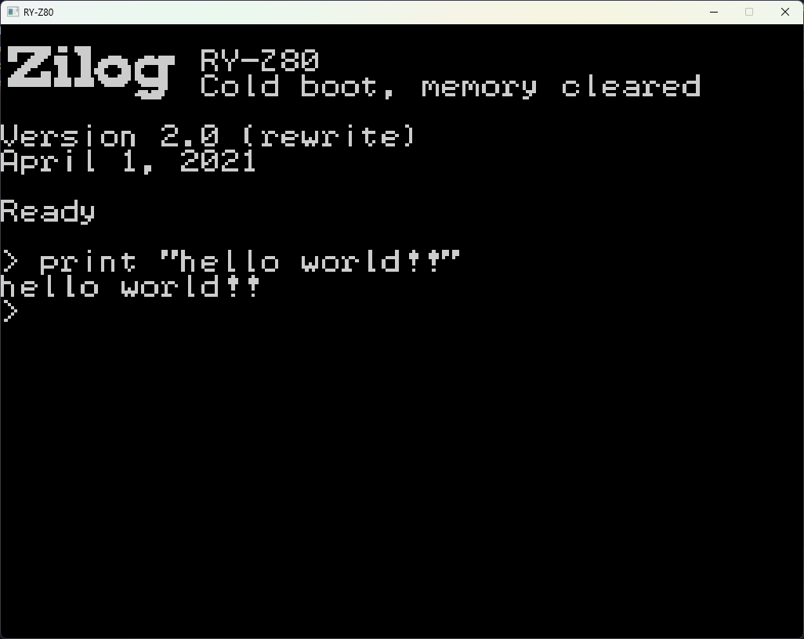

# RZFC

RZFC is an old project (with a new name that I just came up with on the spot) from 2020, which intended to emulate my homebuilt Z80 computer. It uses the [z80emu](https://crates.io/crates/z80emu) crate plus my own [TMS9918A emulator](https://crates.io/crates/tms9918a_emu) crate.

General specs are:
 - 32KB ROM
 - 32KB RAM
 - 16KB VRAM
 - 4 MHz clock (though this emulator currently just runs uncapped)

The included rom.bin file is a very incomplete and broken homemade BASIC interpreter.

# Screenshot

